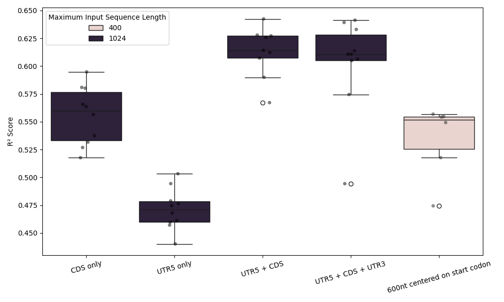

# Experiment 02: CV ablation studies
 #### **Code version:** boxplot formatting (89a2a2921ecdce3d9869bd1e6264fc330312a8e1)

## Results and Next Steps

The results confirm the hypothesis that the interplay between 5'UTR and CDS is essential for model performance.the UTR5+CDS model significantely outperforms the UTR5-only model and the CDS-only model. There is no significant difference between the UTR5+CDS model and the full sequence model, which suggests that the 3'UTR does not add much information for the task. Increasing the model max length to 2044 significantly improves the performance of both UTR5+CDS and full sequence models, pushing performance to around 0.66 R² score. Even at 2044 max length, there is no signicant difference between the UTR5+CDS model and the full sequence model. mRNABERT's better performance at higher model length is thus due to its ability to look at longer 5'UTR and CDS sequences, not its ability to look at longer 3'UTR sequences.




## Objective 

After experimentally testing interesting setups in [experiment 01](01-reproduce_initial_finetuning.md), this experiment formalizes the results using 10-fold cross-validation. This will produce results to present in the report for demosntrating the importance of interplay of CDS and 5'UTR.The 10 folds are defined using RiboNN's original split included in their open excel data.

The start codon window experiment showed that it matches the performance of the CDS model and higher than the 5' UTR model with less than half of the sequence length. This further confirms that the interplay between 5'UTR and CDS is essential for performance. 

## Status
**COMPLETED** 
- **job names**: `cv_cds_only_1024`, `cv_utr5_only_1024`, `cv_utr5_cds_1024`, `cv_utr5_cds_2044`, `cv_full_1024`, `cv_full_2044`, `cv_start_codon_window_400`
## Expected outcomes
- _Deliverables_: results for all sequence modes, lengths and fold splits. a boxsplot comparing the results. 
- _output directory_: `cv_*` in `outputs/`, boxplot at `figures/r2_scores_comparison.png`
- _decisions to take_: final reporting of impact of different sequence parts on model performance in the report.


## Resources required

1 GPU.

## Duration
18.06.2026

## Experiment description

Each experiment consists of running 10 model trainings for 10-fold CV, this is done using slurm job arrays. I run the following experiments:
- full sequence at 1024 max model length: 82.65% of sequences cannot fit the entire sequence into the model including 3' UTR
- 5'UTR only at 1024 max model length: 1% of sequences cannot fit their entire 5' UTR into the model
- 5'UTR + CDS at 1024 max model length: 25% of sequences cannot fit their entire 5' UTR and CDS into the model
- start codon window of 600 nt at 400 max model length: I evaluate whether fine-tuning the model only focused on the start codon region can match the results. all of these truncated sequences can fit obviously
- 5'UTR + CDS at 2044 max model length: 2.32% of sequences cannot fit their entire 5' UTR and CDS into the model
- full sequence at 2044 max model length: 52.33% of sequences still cannot fit into the model because of long 3' UTRs.


### 10-fold CV scripts

all present in `jobs/cv_ablation_studies/`. careful with the `--learning_rate` parameter, increasing model max length to 2044 warrants a decrease in the batch size to 4 to fit in V100 memory. Hence, the learning rate should be decreased. A good heuristic is a linear decrease in learning rate with respect to batch size. 1e-5 is a bit less than that. Here is an example of script.

```bash
#!/bin/bash
#SBATCH --job-name=cv_utr5_cds_1024
#SBATCH --account=master
#SBATCH --nodes=1
#SBATCH --ntasks=1
#SBATCH --cpus-per-task=1
#SBATCH --partition=gpu
#SBATCH --mem=16G
#SBATCH --gres=gpu:1
#SBATCH --time=06:00:00
#SBATCH --array=0-9
#SBATCH --output=outputs/cv_utr5_cds_1024/job_%A_%a.out

eval "$(mamba shell hook --shell bash)"
mamba activate mrnabert
cd /scratch/izar/gabboud/mRNABERT

export WANDB_API_KEY=$(cat ~/.wandb_api_key)
export WANDB_PROJECT=mRNABERT-finetuning
export WANDB_LOG_MODEL=true
export WANDB_WATCH=false
export HF_HOME=/scratch/izar/gabboud/.cache/huggingface

BASE_DATA_PATH=/scratch/izar/gabboud/mRNABERT/processed_data_RiboNN/cv_utr5_cds
OUTPUT_BASE=outputs/cv_utr5_cds_1024

# Map array index to fold directory (sorted order)
FOLD_DIRS=($(ls -d ${BASE_DATA_PATH}/val_fold_* | sort))
FOLD_DIR=${FOLD_DIRS[$SLURM_ARRAY_TASK_ID]}
FOLD_NAME=$(basename ${FOLD_DIR})

VAL_FOLD=$(echo ${FOLD_NAME} | sed 's/val_fold_\([0-9]*\)_test_fold_\([0-9]*\)/\1/')
TEST_FOLD=$(echo ${FOLD_NAME} | sed 's/val_fold_\([0-9]*\)_test_fold_\([0-9]*\)/\2/')

RUN_NAME=cv_utr5_cds_1024_${FOLD_NAME}

mkdir -p ${OUTPUT_BASE}/${FOLD_NAME}

python regression_multilabel.py \
    --data_path ${FOLD_DIR} \
    --run_name ${RUN_NAME} \
    --model_max_length 1024 \
    --per_device_train_batch_size 16 \
    --per_device_eval_batch_size 32 \
    --gradient_accumulation_steps 1 \
    --learning_rate 8e-5 \
    --weight_decay 0.01 \
    --output_dir ${OUTPUT_BASE}/${FOLD_NAME} \
    --num_train_epochs 20 \
    --save_steps 100 \
    --eval_steps 100 \
    --warmup_steps 150 \
    --logging_steps 10 \
    --report_to wandb \
    --freeze_base false \
    --early_stopping_patience 20 \
    --early_stopping_threshold 0.001 \
    --overwrite_output_dir true

# After training, collect results if all 10 folds are done
RESULTS_COUNT=$(find ${OUTPUT_BASE} -name "test_results.json" | wc -l)
if [ "${RESULTS_COUNT}" -eq 1 ]; then
    echo "test_fold,val_fold,eval_r2_mean_TE" > ${OUTPUT_BASE}/cv_results.csv
    for DIR in $(ls -d ${BASE_DATA_PATH}/val_fold_* | sort); do
        FNAME=$(basename ${DIR})
        VF=$(echo ${FNAME} | sed 's/val_fold_\([0-9]*\)_test_fold_\([0-9]*\)/\1/')
        TF=$(echo ${FNAME} | sed 's/val_fold_\([0-9]*\)_test_fold_\([0-9]*\)/\2/')
        JSON=$(find ${OUTPUT_BASE}/${FNAME} -name "test_results.json" | head -1)
        if [ -f "${JSON}" ]; then
            R2=$(python -c "import json; d=json.load(open('${JSON}')); print(d.get('eval_r2_mean_TE', 'NA'))")
            echo "${TF},${VF},${R2}" >> ${OUTPUT_BASE}/cv_results.csv
        else
            echo "${TF},${VF},NA" >> ${OUTPUT_BASE}/cv_results.csv
        fi
    done
    echo "Results written to ${OUTPUT_BASE}/cv_results.csv"
fi
```

## Links and references
TO-DO: list here publications, web pages, etc. that contain information relevant to the experiment. 

