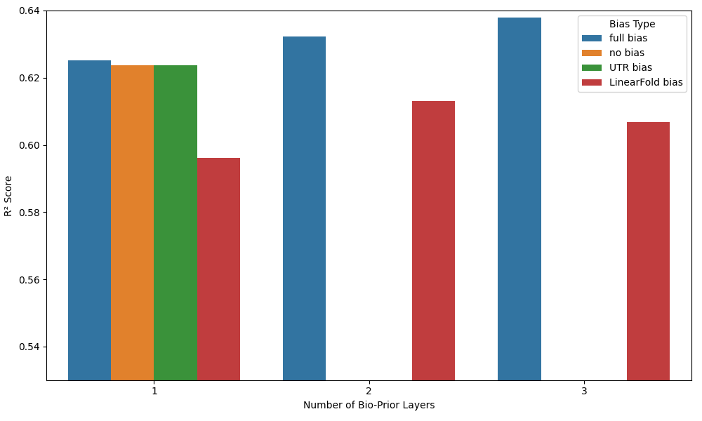
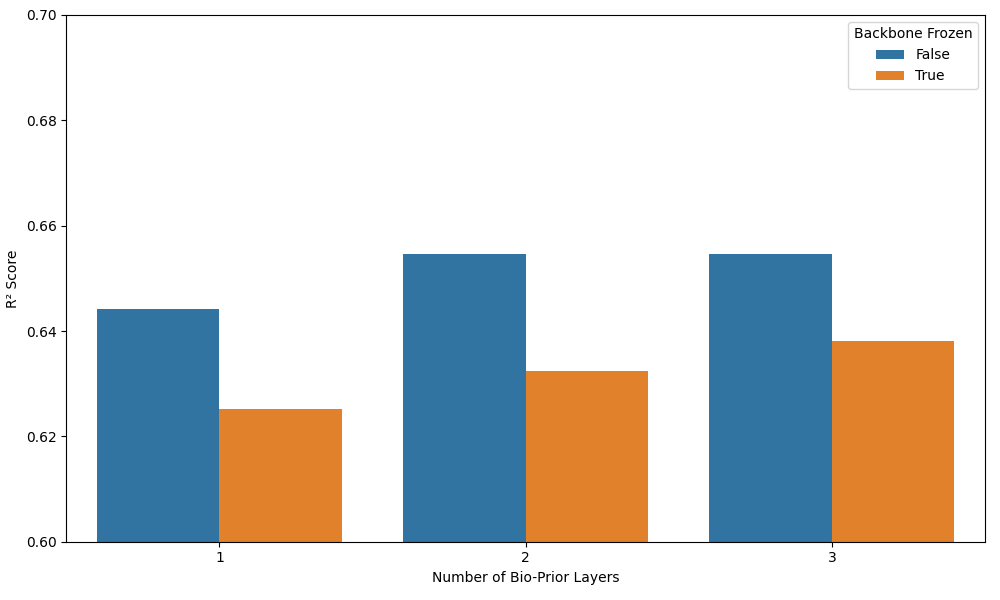

# Experiment 03: Watson-Crick bias model 
 #### **Code version:** initial experiments on bias model variations barplot(fa09a55f5aa1a5d89f1a0ac21cfd2f0eb0be292f)

## Results and Next Steps

for frozen backbones, an increase in the number of Bio-Prior layers from 1 to 2 to 3 leads to an increase in performance from 0.625 to 0.6325 to 0.6375, so all really marginal improvements. There seems to be a bit of a boost when integrating the full bias compared to no bias but we're talking about a 0.0025 absolute increase in R² score, so again very marginal. No difference between "no bias" and "utr only bias", aka the "utr only" bias is useless. 



Unfreezing the backbone shows signs of overfitting on the loss curves but the performance does improve from 0.63 to 0.65. so let's also stick to just training a head. Training with the backbone not frozen also raises training time from 1h30 to 3h. It's not clear whether it's worth it to train with the backbone unfrozen. I will run the CV evaluation with the backbone frozen for now but will ask Parth what he thinks.



For the next step, CV evaluation, I drop the utr_only bias model and I always freeze the backbone, I run "full bias" version and compare it to the "no bias" version. I do this for 1,2 and 3 Bio-Prior layers. This will yield a boxplot with 6 boxes. Then will come three additional boxes with the LinearFold bias version.


## Objective 

We now move on to the integration of secondary structure information into the model. We first start with a version that integrates information about Watson-Crick base pairing bias in the attention heads. We investigate which Watson-Crick setup gives the best performance on one fold before evaluating with cross-validation.

## Status
**IN PROGRESS** 
- **job names**:
    - biased_head_wc_utr5_cds_1024_unfrozen_1_layer_full_bias
    - biased_head_wc_utr5_cds_1024_unfrozen_2_layer_full_bias
    - biased_head_wc_utr5_cds_1024_unfrozen_3_layer_full_bias
    - biased_head_wc_utr5_cds_1024_frozen_1_layer_full_bias
    - biased_head_wc_utr5_cds_1024_frozen_2_layer_full_bias
    - biased_head_wc_utr5_cds_1024_frozen_3_layer_full_bias
    - biased_head_wc_utr5_cds_1024_frozen_1_layer_utr_bias
    - biased_head_wc_utr5_cds_1024_frozen_1_layer_no_bias

## Expected outcomes
- _Deliverables_: 
- _output directory_: `biased_head_*` in `outputs/`, barplots at `figures/bioprior_bias_type.png` and `figures/bioprior_frozen.png`.
- _decisions to take_: decision of which modes to investigate in CV and to compare to base fine-tuning and later LinearFold based bias.


## Resources required

1 GPU.

## Duration
21.06.2026

## Experiment description

I implemented a version of the model that integrates Watson-Crick base pairing bias in the attention heads. The logic is:
- at initialization of training, a vocab_size x vocab_size matrix is created that defines the bias for each pair of tokens. G-C is 3, A-T is 2, G-T is 1 (wobble) and all the rest is 0. 
- then the batch collator handles the creation of a bias matrix when each batch is creates. The main call function of the batch collator is overriden to create the bias matrix. I chose this over pre-computing the bias matrix for all sequences because this way it adapts automatically to different max model lengths. Storing bias matrices for full-length sequences and then truncating would be too memory intensive. There is not much overhead at each batch creation because bias creation becomes a simple matrix indexation using input_ids.
- `BioPriorAttention` is a normal attention layer but it adds the bias matrix to the attention scores before softmax. positive scores will increase the chance that the model looks there.
- `mRNABERTWithPriorHead` should be passed a base model, this is defined in the training script using `from_pretrained`. Then, `BioPriorAttention` adds a given number of `BioPriorAttention` layers. Training script is unchanged.
- Three bias options are implemented: `full` calculates biases between nucleotide-nucleotide pairs but also codon-codon pairs and nucleotide-codon pairs. codons are handled by adding up scores between all pairs of codons. `utr_only` calculates biases only between nucleotides. All pairs involving codons have bias of 0. `no bias` has no bias whatsoever so it's equivalent to adding one additional attention layer to the base model.


All experiments use a 1024 max model length and only the utr_cds sequence mode. I use one fold split to test the effect of number of Bio-Prior layers, of freezing the backbone and of the type of bias.


### example scripts

all present in `jobs/wc_tests/`.


```bash
#!/bin/bash
#SBATCH --job-name=biased_head_wc_utr5_cds_1024_unfrozen_1_layer_full_bias
#SBATCH --account=master
#SBATCH --nodes=1
#SBATCH --ntasks=1
#SBATCH --cpus-per-task=1
#SBATCH --partition=gpu
#SBATCH --mem=16G
#SBATCH --gres=gpu:1
#SBATCH --time=06:00:00
#SBATCH --output=outputs/biased_head_wc_utr5_cds_1024_unfrozen_1_layer_full_bias/job_%j.out

eval "$(mamba shell hook --shell bash)"
mamba activate mrnabert
cd /scratch/izar/gabboud/mRNABERT

export DATA_PATH=/scratch/izar/gabboud/mRNABERT/processed_data_RiboNN/utr5_cds_val_fold_8_test_fold_9

export WANDB_API_KEY=$(cat ~/.wandb_api_key)
export WANDB_PROJECT=mRNABERT-finetuning
export WANDB_LOG_MODEL=false
export WANDB_WATCH=false
export HF_HOME=/scratch/izar/gabboud/.cache/huggingface

export JOB_NAME=biased_head_wc_utr5_cds_1024_unfrozen_1_layer_full_bias

mkdir -p outputs/${JOB_NAME}


python train_biased_head.py \
    --data_path ${DATA_PATH} \
    --run_name ${JOB_NAME} \
    --model_max_length 1024 \
    --per_device_train_batch_size 16 \
    --per_device_eval_batch_size 32 \
    --gradient_accumulation_steps 1 \
    --learning_rate 8e-5 \
    --weight_decay 0.01 \
    --output_dir outputs/${JOB_NAME} \
    --num_train_epochs 20 \
    --save_steps 100 \
    --eval_steps 100 \
    --warmup_steps 150 \
    --logging_steps 10 \
    --report_to wandb \
    --early_stopping_patience 20 \
    --early_stopping_threshold 0.001 \
    --overwrite_output_dir true \
    --num_heads 8 \
    --num_bio_layers 1 \
    --freeze_backbone false \
    --bias full

```

## Links and references
This idea is taken from Weijie et al. 2025, ["ERNIE-RNA: an RNA language model with structure-enhanced representations"](https://www.nature.com/articles/s41467-025-64972-0). They used this for pre-training and showed that it allowed to learn secondary structure information that their base model didn't.
