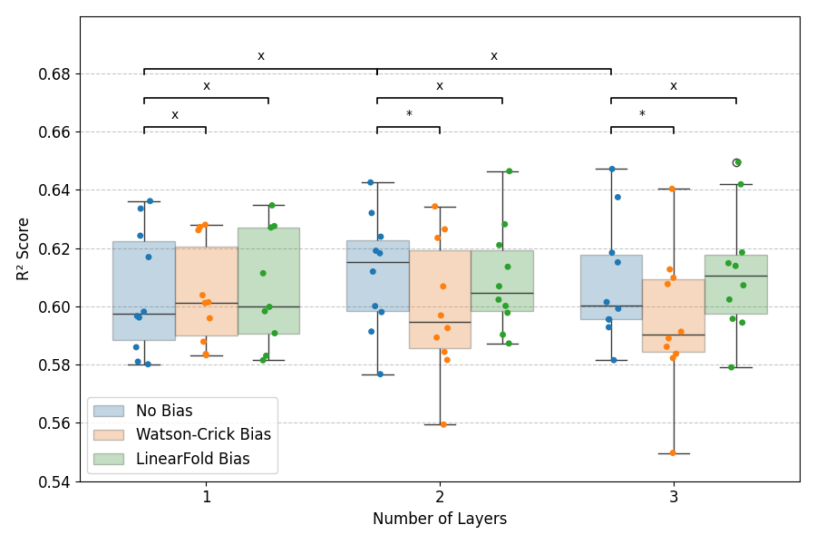

# Experiment 06: 10-fold cross-validation on LinearFold bias model
 #### **Code version:** cv bias comparison update(701a212dcead099b89e21f34eebf443dcfb6ebbe)

## Results and Next Steps

When applying the Bonferroni correction, all of the models are statistically similar. There is however a trend for lower performance of the Watson-Crick bias model. Attention scores, $S=\frac{QK^T}{\sqrt(d_k)}$, are engineered to have mean 0 and variance 1 so typically values range from -5 to 5. The all-to-all bias scores I introduce are probably too big, they can reach up to 27 for a codon pair GGG and CCC. The bias scores of the LinearFold model are between 0 and 3, which is more in line with the attention scores.


Adding layers does not increase performance. This is not surprising as the train vs eval loss curves showed a higher tendency to overfit for the 2 and 3 layer models, the 2M parameters of the 1 layer model are probably enough to learn the task.


## Objective 

Compare the performance of the LinearFold bias model with No Bias model and Watson-Crick bias model using 10-fold cross-validation.


## Status
**IN PROGRESS** 
- **job names**: FILL

## Expected outcomes
- _Deliverables_: supplement the final cv boxplot with the LinearFold bias model results.
- _output directory_: `outputs/cv_biased_full_1024_frozen_1_layer_lf_bias` and `2_layer` and `3_layer` variants.
- _decisions to take_: final reporting of performance in report.


## Resources required

1 GPU.

## Duration
23.06.2026

## Experiment description

Usual 10-fold cross-validation setup.

### example scripts

all present in `jobs/lf_tests/`.


```bash
#!/bin/bash
#SBATCH --job-name=cv_biased_full_1024_frozen_1_layer_lf_bias
#SBATCH --account=master
#SBATCH --nodes=1
#SBATCH --ntasks=1
#SBATCH --cpus-per-task=1
#SBATCH --partition=gpu
#SBATCH --mem=16G
#SBATCH --gres=gpu:1
#SBATCH --time=05:00:00
#SBATCH --array=0-9
#SBATCH --output=outputs/cv_biased_full_1024_frozen_1_layer_lf_bias/job_%j.out

eval "$(mamba shell hook --shell bash)"
mamba activate mrnabert
cd /scratch/izar/gabboud/mRNABERT

export WANDB_API_KEY=$(cat ~/.wandb_api_key)
export WANDB_PROJECT=mRNABERT-finetuning
export WANDB_LOG_MODEL=true
export WANDB_WATCH=false
export HF_HOME=/scratch/izar/gabboud/.cache/huggingface
export BIAS_PATH=/scratch/izar/gabboud/mRNABERT/processed_data_RiboNN/all_lf_bias.npz

BASE_DATA_PATH=/scratch/izar/gabboud/mRNABERT/processed_data_RiboNN/cv_full
OUTPUT_BASE=outputs/cv_biased_full_1024_frozen_1_layer_lf_bias

# Map array index to fold directory (sorted order)
FOLD_DIRS=($(ls -d ${BASE_DATA_PATH}/val_fold_* | sort))
FOLD_DIR=${FOLD_DIRS[$SLURM_ARRAY_TASK_ID]}
FOLD_NAME=$(basename ${FOLD_DIR})

VAL_FOLD=$(echo ${FOLD_NAME} | sed 's/val_fold_\([0-9]*\)_test_fold_\([0-9]*\)/\1/')
TEST_FOLD=$(echo ${FOLD_NAME} | sed 's/val_fold_\([0-9]*\)_test_fold_\([0-9]*\)/\2/')

RUN_NAME=cv_biased_full_1024_frozen_1_layer_lf_bias_${FOLD_NAME}

mkdir -p ${OUTPUT_BASE}/${FOLD_NAME}


python train_biased_head.py \
    --data_path ${FOLD_DIR} \
    --run_name ${RUN_NAME} \
    --model_max_length 1024 \
    --per_device_train_batch_size 16 \
    --per_device_eval_batch_size 32 \
    --gradient_accumulation_steps 1 \
    --learning_rate 8e-5 \
    --weight_decay 0.01 \
    --output_dir ${OUTPUT_BASE}/${FOLD_NAME} \
    --num_train_epochs 20 \
    --save_steps 100 \
    --eval_steps 100 \
    --warmup_steps 150 \
    --logging_steps 10 \
    --report_to wandb \
    --early_stopping_patience 20 \
    --early_stopping_threshold 0.001 \
    --overwrite_output_dir true \
    --num_heads 8 \
    --num_bio_layers 1 \
    --freeze_backbone true \
    --bias linearfold \
    --linearfold_bias_file ${BIAS_PATH}
```

## Links and references
TO-DO: list here publications, web pages, etc. that contain information relevant to the experiment. 

