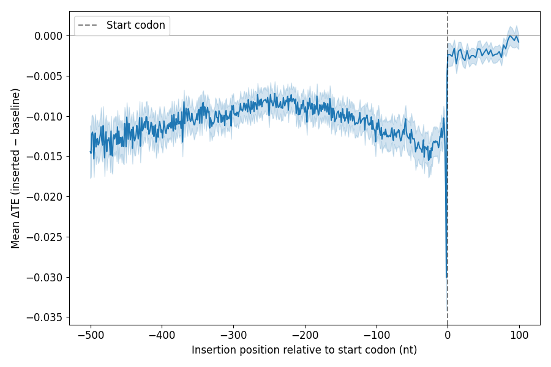

# Experiment 09: Evaluate effect of uAUG insertion on model predictions
 #### **Code version:** uAUG insertional analysis(484a52ffd36f7cd4446ef78e5af3f59f41cb15ac)

## Results and Next Steps

negative contribution of insertion of AUG in the 5'UTR and not much effect of insertion in the CDS. delta TE is around 0.01, 0.015 in the 5' UTR while it makes no difference in the CDS. These values of delta TE are similar to what RiboNN's analysis found.

The negative contribution gets stronger as we get closer to the start codon. There is one big dip at insertion position -2. This corresponds to the disruption of the Kozak sequence, especially the conserved purine A/G at position -3 that becomes a T once the ATG is inserted at position -2, showing that mRNABERT has learnt the importance of this main motif of the kozak sequence.




## Objective 

I want to show that the model has learnt the effect of uAUG insertion on translation efficiency. 

## Status
**COMPLETED** 
- **job names**: insertional_analysis

## Expected outcomes
- _Deliverables_: A graph showing delta in predicted TE on the y-axis and the position of the uAUG insertion on the x-axis.
- _output directory_: new script `insertional_analysis.py`, results at `outputs/insertional_analysis/`, graph at `figures/uAUG_insertion_delta_TE.png`
- _decisions to take_: N/A


## Resources required

1 GPU.

## Duration
01.07.2026

## Experiment description

I will use a no-bias model with 1 Bio-Prior layer, I select the fold with the highest TE, aka `outputs/cv_biased_full_1024_frozen_1_layer_no_bias/val_fold_4_test_fold_3`. I do that because my analysis shows that increasing the number of Bio-Prior layers or adding bias does not help so might as well take the simplest model. I will use the test set of that fold and keep only sequences that have a UTR longer than 501 nucleotides and an open reading frame of at least 300 nucleotides. For each of these sequences, I will insert a AUG codon at each position and predict the TE. Note that the inserting within the CDS I will only insert AUG codons that are in frame with the original CDS. I will then calculate the delta TE for each position and for each transcript. I will then plot the average delta TE for each position across all transcripts.


```bash
#!/bin/bash
#SBATCH --job-name=insertional_analysis
#SBATCH --account=master
#SBATCH --nodes=1
#SBATCH --ntasks=1
#SBATCH --cpus-per-task=1
#SBATCH --partition=gpu
#SBATCH --mem=16G
#SBATCH --gres=gpu:1
#SBATCH --time=01:00:00
#SBATCH --output=outputs/insertional_analysis/max_seq_200_upstream_500/job_%j.out

eval "$(mamba shell hook --shell bash)"
mamba activate mrnabert
cd /scratch/izar/gabboud/mRNABERT

export UPSTREAM_WINDOW=500
export DOWNSTREAM_WINDOW=100
export OUTPUT_CSV_PATH="outputs/insertional_analysis/max_seq_200_upstream_500/insertional_analysis_results.csv"
export MAX_SEQUENCES=200

python insertional_analysis.py \
    --upstream_window $UPSTREAM_WINDOW \
    --downstream_window $DOWNSTREAM_WINDOW \
    --output_csv_path $OUTPUT_CSV_PATH \
    --max_sequences $MAX_SEQUENCES


```


## Links and references
TO-DO: list here publications, web pages, etc. that contain information relevant to the experiment. 

