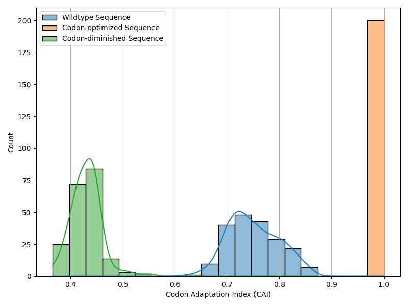
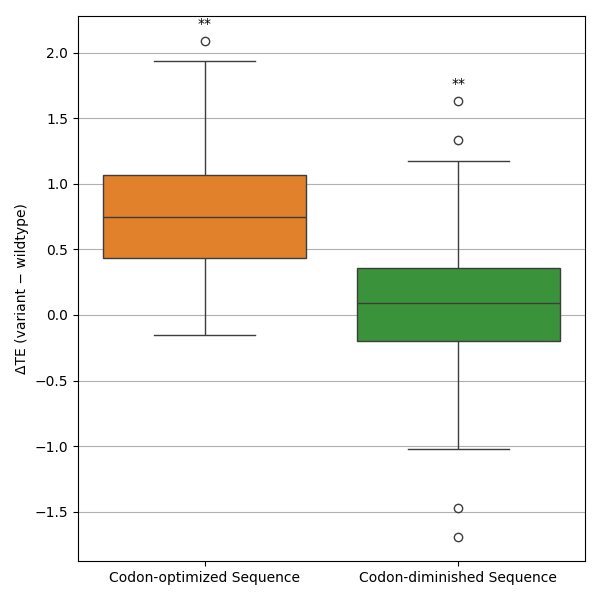
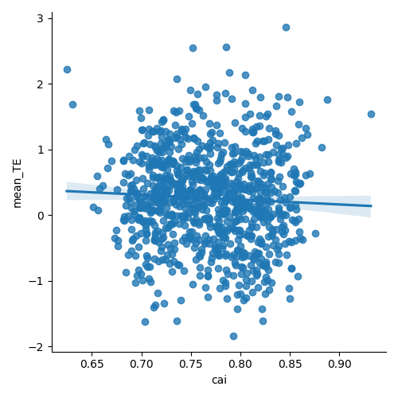

# Experiment 10: Evaluate whether model has learnt codon optimality in the CDS
 #### **Code version:** codon optimality analysis(fb3f64f919c303fb44122582b1017a0c1646c9d2)

## Results and Next Steps

CAI is always 1 for optimized sequences as expected and varies for diminished sequences, typically around 0.4-0.5. 



delta TE for optimized sequences is around 0.75 which is quite significant knowing that TE values range between [-2,2]. delta TE for diminished sequences is surprisingly positive but low at around 0.1, which may not be biologically relevant. A potential explanation could be that the model has learnt to focus on a couple of highly influential codons that promote TE. 



I also noticed that in the dataset per se there is no correlation between CAI and ground-truth mean_TE, which is surprising. Does it make sense to report that the model has learnt this optimality feature that we know from the literature if the dataset itself does not show this correlation? 



## Objective 

I want to show that the model has learnt optimal codons in the CDS and their impact on translation efficiency. Also hint at how the model could be used to evaluate the effect of synonymous mutations.

## Status
**COMPLETED** 
- **job names**: codon_test

## Expected outcomes
- _Deliverables_: A graph showing delta in predicted TE on the y-axis and the position of the uAUG insertion on the x-axis.
- _output directory_: new script `codon_optimality_analysis.py`, results at `outputs/codon_test/`, graph at `figures/cai_hist.png` and `figures/codon_delta_TE_boxplot.png`
- _decisions to take_: N/A


## Resources required

1 GPU.

## Duration
01.07.2026

## Experiment description

I will use a no-bias model with 1 Bio-Prior layer, I select the fold with the highest TE, aka `outputs/cv_biased_full_1024_frozen_1_layer_no_bias/val_fold_4_test_fold_3`. I do that because my analysis shows that increasing the number of Bio-Prior layers or adding bias does not help so might as well take the simplest model. I will use the test set of that fold and keep only sequences that have a UTR shorter than 300 nucleotides to keep enough tokens to use on the CDS. For each of these sequences, I create two variants, one that uses the optimal synonymous codons in humans and one that uses the least optimal synonymous codons in humans. I will then predict the TE for each of these variants and calculate the delta TE for each transcript. I will then plot the average delta TE across all transcripts. I will also plot a histogram of the CAI values of the original sequences. 


```bash
#!/bin/bash
#SBATCH --job-name=codon_test
#SBATCH --account=master
#SBATCH --nodes=1
#SBATCH --ntasks=1
#SBATCH --cpus-per-task=1
#SBATCH --partition=gpu
#SBATCH --mem=16G
#SBATCH --gres=gpu:1
#SBATCH --time=01:00:00
#SBATCH --output=outputs/codon_test/job_%j.out

eval "$(mamba shell hook --shell bash)"
mamba activate mrnabert
cd /scratch/izar/gabboud/mRNABERT

python codon_optimality_analysis.py \
    --output_csv_path "outputs/codon_test/codon_test_results.csv" \
    --max_sequences 200
```


## Links and references
TO-DO: list here publications, web pages, etc. that contain information relevant to the experiment. 

