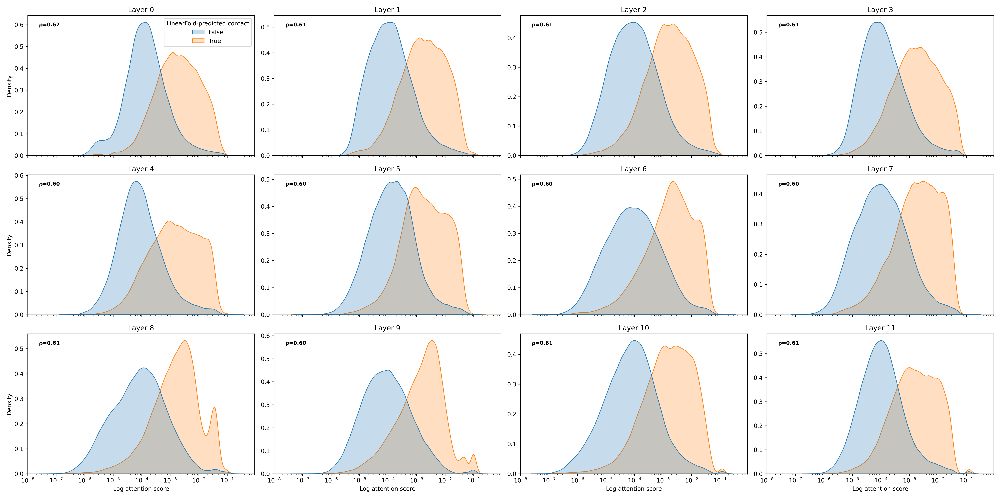
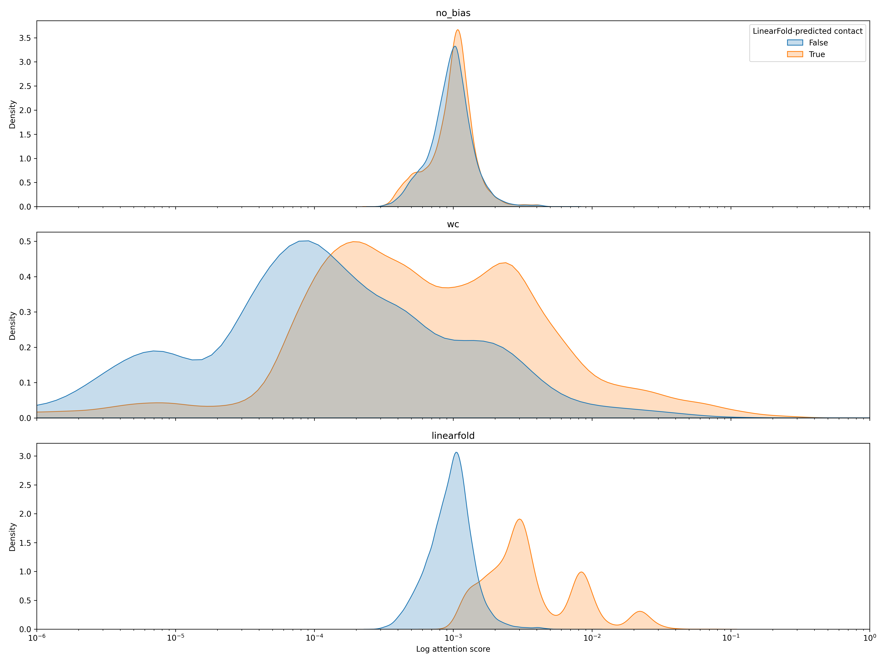

# Experiment 11: Check whether the layers' attention scores coincide with LinearFold-predicted contacts
 #### **Code version:** plot attn corr (6e5d50089af9fc846e3900afcd919d46c1ce6e0b)

## Results and Next Steps

NOTE: THESE CONCLUSIONS ARE ACUALLY FALSE. I REALIZED MY EXPERIMENT HAD A CONFOUNDER LATER ON, SEE EXPERIMENT 13.

The sanity check with the `--evaluate_test_set` option shows the consistency of the monkeypatch method. I visualized the attention scores as KDE plots for each layer, with the hue parameter set to whether LinearFold predicts a contact or not. I also show the spearman correlation between the attention scores and the LinearFold bias scores. First, looking at the backbone layers reveals that these layers already learn to give higher attention to pairs that are predicted by LinearFold to be in contact. It should be noted that at no point has the backbone training included secondary structure information. It is learnt naturally from the masked language modeling task. 




As for the Bio-Layer, the head trained with no bias does not learn to reproduce this pattern from being tuned on the RiboNN task. The LF-biased one obviously does because the LF contact map is explicitely baked into the attention scores as bias. The LF-biased model shows a tri-modal distribution of attention scores for contact pairs, corresponding to the 3 possible values of the LF bias score: 1,2,3 in our implementation. This means that the bias does not help because this information is already learnt in pre-training. 



## Objective 

[Experiment 05](05-LinearFold_bias.md) showed that integrating bias terms into the model does not improve the model's performance. A theory could be that the mRNABERT backbone has already learnt the RNA secondary structure and that the bias terms are redundant. To test this theory, I check at each layer of the model whether the attention scores coincide with the contacts predicted by LinearFold.

## Status
**COMPLETED** 
- **job names**: attention_correlation

## Expected outcomes
- _Deliverables_: A visuali
- _output directory_: new script `attention_linearfold_correlation.py`, results at `outputs/attention_correlation/`, graph at `figures/attention_backbone_grid` and `figures/attention_bioprior_grid.png`
- _decisions to take_: conclusion in the report on whether that hypothesis is valid or not.


## Resources required

1 GPU.

## Duration
02.07.2026

## Experiment description


The script `attention_linearfold_correlation.py` uses a monkey-patch approach, aka after initializing the model, we override its forward method for that particular instance. For backbone layers, this forces the model to do a standard torch-based attention calculation instead of using the Triton kernels. It also forces it to save the attention scores for each layer instead of discarding them. The trade-off is increased memory usage so we need to pass the sequences one at a time. For the Bio-Prior Layers there is no accelerated kernel but we still need to override to save the scores. 

For each sequence, the script retrieves its LinearFold contact map. If there are N contacts predicted, we save the attention scores for these N pairs of tokens. We also sample N x `negative_ratio` pairs of non-contact tokens and get their attention scores as well. Attention scores are averaged over all heads for each layer and are symmetrized. We get a final dataframe with sequence id, layer, LF bias score and attention score.  

I run the scripts for the 3 models: no bias, wc bias, and LF bias. All of them share the same frozen backbone so attention scores are the same. Their Bio-layer attention scores differ. I use the models with one Bio-layer: I tried with 3 Bio-layers but the results are the same for the 3 layers. I plot the attention scores for each layer as a kde plot on a log-log scale (attention scores are heavily sparse and heavy-tailed). I choose the val_fold=4 and test_fold=3 because it has the highest R2 across the 3 models.

To make sure that the monkeypatch reimplementations are correct and do not change the math at inference, I implement an option `--evaluate_test_set` that uses this new monkeypatch forward method to get test metrics on the entire test set. I compare the results with the test metrics obtained from the HFTrainer in train_biased.py.

```bash
#!/bin/bash
#SBATCH --job-name=attention_correlation
#SBATCH --account=master
#SBATCH --nodes=1
#SBATCH --ntasks=1
#SBATCH --cpus-per-task=1
#SBATCH --partition=gpu
#SBATCH --mem=16G
#SBATCH --gres=gpu:1
#SBATCH --time=01:00:00
#SBATCH --output=outputs/attention_correlation/balanced_sampling_200_seqs_lf/job_%j.out

eval "$(mamba shell hook --shell bash)"
mamba activate mrnabert
cd /scratch/izar/gabboud/mRNABERT

python attention_linearfold_correlation.py \
    --output_pairs_csv "outputs/attention_correlation/balanced_sampling_200_seqs_lf/attention_correlation_results.csv" \
    --output_correlation_csv "outputs/attention_correlation/balanced_sampling_200_seqs_lf/attention_correlation_summary.csv" \
    --max_sequences 200 \
    --negative_ratio 1 \
    --checkpoint_path "/scratch/izar/gabboud/mRNABERT/outputs/cv_biased_full_1024_frozen_1_layer_lf_bias/val_fold_4_test_fold_3" \
    --bias linearfold \
    --linearfold_bias_file "/scratch/izar/gabboud/mRNABERT/processed_data_RiboNN/all_lf_bias.npz" \
    --test_csv_path "processed_data_RiboNN/cv_full/val_fold_4_test_fold_3/test.csv"
```


## Links and references
TO-DO: list here publications, web pages, etc. that contain information relevant to the experiment. 

