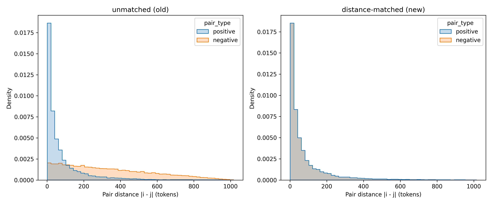

# Experiment 12: Fix the attention correlation experiment to eliminate confounder
 #### **Code version:** attention heatmap examples(1dba24e5c47f426f680bc49c0f6c52c3998d1bc8)

## Results and Next Steps

The new correlation results from `study_attention_ss_correlation.py` after accounting for distance-matching tell a different story. The backbone layers do not show any correlation with secondary structure with spearman r values between 0.042 and 0.065. For the no_bias mode, the additional head that was fine-tuned on the TE task shows a spearman r of 0.18, which is still low but higher than the backbone layers. The wc head shows spearman of 0.45 and the LinearFold head of 0.87. The fact that the LF head has super high corr is expected since the LF predictions are directly injected into the attention scores as bias. The key interesting result is that the non-biased head develops an understanding of secondary structure when fine-tuned on the TE task while the backbone does not learn that during pre-training, despire pre-training being on a very large dataset and using much more compute.

## Objective 

While visualizing attention scores given to sequences as a heatmap I noticed:
1) LinearFold-predicted contacts tend to cluster around the diagonal, aka mostly local
2) The attention scores of the backbone layers hug the diagonal, aka there is a bias for local interactions. This is not learnt, it's engineered into the model because the backbone uses ALiBi which adds a bias inversely proportional to the distance between tokens.

This created a confounder in experiment 11: I compared positive samples, which correspond to LinearFold-predicted contacts, with negative samples. But negative samples were sampled randomly from the entire sequence, so they are mostly non-local. This can be seen in this histogram



The apparent correlation I observed was actually due to the backbone's bias for local interactions, not because the backbone learnt secondary structure. This is why I fix the experiment by sampling negative samples that are distance-matched to the positive samples (right subplot of the histogram). This way, the two sample categories have the same distance distributions and I can see if different layers have learnt ss pairing indepedently of distance.


## Status
**COMPLETED** 
- **job names**: attention_correlation, 
## Expected outcomes
- _Deliverables_: Fix results about attention correlation, visualization of heatmaps for a couple of examples. 
- _output directory_: all folders ending with `*_distance_matched` in `outputs/attention_correlation`
- _decisions to take_: N/A


## Resources required

1 GPU.

## Duration
03.07.2026

## Experiment description


Just changed the sampling of negative samples in `analysis.py` to implement distance-matching. Then I re-ran the attention correlation experiment for backbone and for no_bias, linearfold, wc heads. All job scripts are under `jobs/attention_correlation/*_distance_matched.slurm`. 

### example slurm scripts
```bash
#!/bin/bash
#SBATCH --job-name=attention_correlation
#SBATCH --account=master
#SBATCH --nodes=1
#SBATCH --ntasks=1
#SBATCH --cpus-per-task=1
#SBATCH --partition=gpu
#SBATCH --mem=16G
#SBATCH --gres=gpu:1
#SBATCH --time=01:00:00
#SBATCH --output=outputs/attention_correlation/balanced_sampling_400_seqs_distance_matched/job_%j.out

eval "$(mamba shell hook --shell bash)"
mamba activate mrnabert
cd /scratch/izar/gabboud/mRNABERT

python study_attention_ss_correlation.py \
    --checkpoint_path outputs/cv_biased_full_1024_frozen_1_layer_no_bias/val_fold_4_test_fold_3 \
    --linearfold_bias_file processed_data_RiboNN/all_lf_bias.npz \
    --test_csv_path processed_data_RiboNN/cv_full/val_fold_4_test_fold_3/test.csv \
    --output_pairs_csv "outputs/attention_correlation/balanced_sampling_400_seqs_distance_matched/attention_correlation_results.csv" \
    --output_correlation_csv "outputs/attention_correlation/balanced_sampling_400_seqs_distance_matched/attention_correlation_summary.csv" \
    --max_sequences 400 \
    --evaluate_test_set \
    --negative_ratio 1

```


## Links and references
TO-DO: list here publications, web pages, etc. that contain information relevant to the experiment. 

